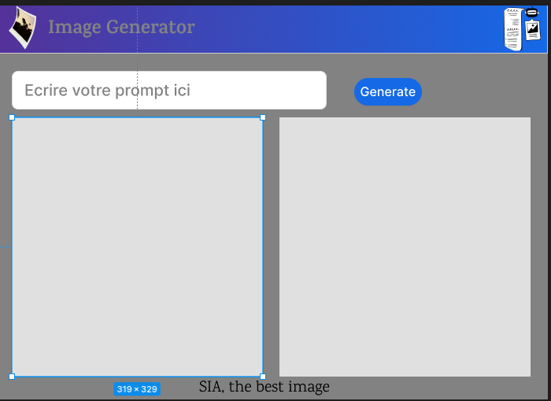

# SIA - Image Generator



Bienvenue dans **SIA**, une application interactive pour générer des images à partir de texte en utilisant des modèles de diffusion. Cette application est construite avec `Tkinter` et `Diffusers`, et fournit une interface utilisateur intuitive pour explorer la génération d'images.

---

## 📋 Fonctionnalités
- **Génération d'images** : Créez des images en entrant une description textuelle (prompt).
- **Téléchargement de modèles personnalisés** : Changez de modèle pour personnaliser les résultats.
- **Interface utilisateur intuitive** : Simple et efficace, avec support des spinners pour le chargement.
- **Double affichage** : Comparez deux images générées à partir du même prompt.

---

## 🚀 Installation

### Prérequis
- **Python 3.9+**
- Les bibliothèques suivantes :
  - `tkinter`
  - `diffusers`
  - `pillow`
  - `json`
  - `threading`

### Étapes
1. Clonez ce repository :
    ```bash
    git clone https://github.com/StephaneBah/Image_Generator.git
    cd Image_Generator
    ```

2. Installez les dépendances :
    ```bash
    pip install -r requirements.txt
    ```

3. Lancez l'application :
    ```bash
    python gui.py
    ```

---

## 🖼️ Comment changer de modèle

1. **Accéder au fichier de configuration** :
   - Le fichier `model_config.json` contient le nom du modèle actuellement utilisé.
   - Vous pouvez modifier le modèle en remplaçant le champ `"model_name"`.

2. **Exemple** :
   Si vous voulez utiliser un modèle comme `stabilityai/stable-diffusion-2`, dans le fichier gui.py mettez :
   ```python
   current_model_name = "stabilityai/stable-diffusion-2"
